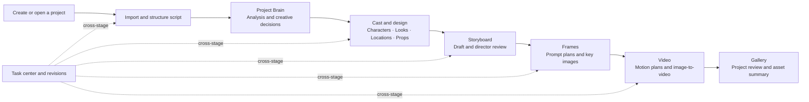
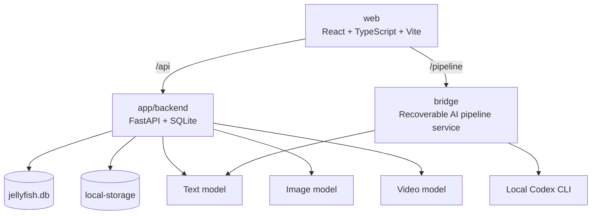

<p align="center">
  
</p>

<p align="center">
  <a href="README.md">简体中文</a> · <a href="README.en.md">English</a>
</p>

<p align="center">
  
  
  
  
  
  
  <a href="LICENSE"></a>
  <a href="https://github.com/mmlong818/shotcat"></a>
</p>

# Shotcat 2.0

Shotcat 2.0 is a local-first AI production workbench for motion comics, short-form drama, and visual preproduction. It connects project understanding, production design, shot planning, image prompt design, keyframe generation, and image-to-video work in one recoverable and reviewable pipeline.

Shotcat is not a one-click black box. Every stage has explicit inputs, inspectable intermediate results, version history, and persistent task state. Characters, looks, locations, and props become stable assets that downstream storyboard, frame, and video tasks reference by identity.

> Shotcat 2.0 is developed separately from [Shotcat 1.x](https://github.com/mmlong818/shotcat). The original repository keeps the 1.x Star history, while 2.0 does not overwrite the original codebase or local data.

## What changed in 2.0

- **Project Brain** separates source facts, user decisions, and AI inferences, with confirm, reject, lock, and re-analysis controls.
- **Continuity-aware assets** let users generate, upload, name, adopt, and lock characters, looks, locations, and props, then reference them by stable IDs.
- **Director-led storyboarding** saves the full draft first, runs a director review, and repairs only the affected shots. Black frames, inserts, and transition shots are valid.
- **Prompt-as-Code** breaks frame prompts into subject, action, composition, camera, lighting, continuity, reference roles, and negative constraints.
- **Video workbench** configures video models independently and supports first-frame, last-frame, first-and-last, keyframe, and text-only generation modes when the selected model allows them.
- **Persistent task center** restores progress after navigation or reload and supports cancellation, retry, and result reconciliation.
- **Restorable revisions** expose stage progress, snapshots, and restore actions from the project overview.
- **Light and dark themes** are available across the main production pages.

## End-to-end workflow



New projects enter the Script stage so work starts from the source material. Existing projects open on Project Overview and highlight the last unfinished stage.

## Screenshots

These images show representative Shotcat 2.0 workbench states. The interface continues to evolve; the current code is the source of truth.

| Project overview | Production design assets |
| --- | --- |
|  |  |

| Storyboard design | Frame generation |
| --- | --- |
|  |  |

## Capability map

| Stage | Main input | Main output | Key controls |
| --- | --- | --- | --- |
| Project | Name, format, aspect ratio, source files | Project container, progress, revisions | Create, open, archive, restore |
| Script | Text or file | Episodes, scenes, dialogue, and action | Edit, re-parse, preserve source |
| Brain | Full script and creative direction | World, relationships, themes, facts, and inferences | Confirm, reject, lock, re-analyze |
| Cast | Extracted entities and user references | Character, look, location, and prop assets | Upload, name, generate, adopt, lock, impact-aware delete |
| Storyboard | Scenes, assets, and directing rules | A connected shot sequence | Shot breakdown, film language, director review, targeted repair |
| Frames | Shots and asset references | Structured prompt plans and key images | Composition, continuity, reference roles, single or batch generation |
| Video | Keyframes, shot movement, and video model | Motion plan, video clip, and task state | Frame strategy, duration, resolution, prompt, cancellation |
| Gallery | All persisted production assets | Project-wide review | Inspect outputs and return to the source stage |

## Core design decisions

### Project Brain: facts before invention

The Project Brain does not treat every model output as ground truth. Each knowledge item records:

- **Origin:** source text, user input, or AI inference.
- **State:** draft, confirmed, or rejected.
- **Lock:** confirmed creative decisions can be protected from later re-analysis.

This prevents a re-run of extraction, script parsing, or another stage from silently replacing approved project decisions.

### Assets: stable references, not disposable thumbnails

Characters, looks, locations, and props are stored as independent assets. Users can upload an approved design, assign its name, and adopt it as the active version. Storyboard and frame tasks reference asset records rather than temporary filenames, so relationships survive regeneration, renaming, and version changes.

Before deletion, Shotcat checks where an asset is used and explains the downstream impact. A confirmed cascade removes dependent references and derived results together instead of leaving broken shots or prompts.

### Storyboard: persist, review, then repair

A full AI shot breakdown follows this order:

1. Generate and persist the complete shot draft.
2. Review shot size, angle, movement, axis, pacing, dialogue ownership, and continuity.
3. Identify exact shots and reasons when the director rules find a problem.
4. Start correction automatically after confirmation and replace only the named shots.
5. Keep unaffected shots, task history, and recoverable revisions.

Black frames, empty establishing shots, title cards, and sound-leading transitions are valid narrative choices. The rules do not force a visible character into every shot.

### Frames: structured prompts and continuity plans

Each frame task produces an inspectable plan before calling the image model. The plan covers:

- subject identity and current costume/look;
- location, time, weather, and lighting;
- action, expression, eye line, and spatial position;
- shot size, angle, lens intent, composition, and depth of field;
- continuity constraints from adjacent shots;
- character, look, location, and prop reference roles;
- negative constraints for content the model should avoid.

The OpenAI `gpt-image-2` path sends actual image bytes as repeated multipart `image[]` fields. It never treats an internal Shotcat file ID as image content.

### Video: a separate production stage after frames

The Video page organizes work shot by shot. Users select an available model, reference-frame mode, resolution, and duration, review the generated motion plan, then edit the final prompt and run the task.

The plan makes the following visible:

- start and end visual states;
- subject action, camera movement, and pacing;
- the role of each first, last, or key reference frame;
- a time-segmented motion timeline and audio approach;
- warnings when the requested mode exceeds model capability.

The current MiniMax H3 adapter supports text-only, first-frame, last-frame, first-and-last, and keyframe modes at 768P or 2K for 4–15 seconds. It does not support a simultaneous first + last + keyframe request, and seed or watermark are not exposed as supported controls.

> “Integrated” means that provider calls and capability rules exist in the code. It does not guarantee that a particular account has access to the model or that a paid call has been validated on the current machine.

## Models and providers

Text, image, and video models are configured independently. A project does not need to use the same provider for all three capabilities.

| Capability | Built-in provider adapters | Used for |
| --- | --- | --- |
| Text | OpenAI, Alibaba Cloud Model Studio, local Codex pipeline | Script analysis, design extraction, storyboards, prompts, and plans |
| Image | OpenAI, Volcengine | Design sheets and shot keyframes |
| Video | OpenAI, Volcengine, MiniMax | Shot-level video generation |

If no text or image model is configured on first launch, Shotcat asks for the provider, model ID, endpoint, and API key separately. Video models are configured from the Video page. Configuration is stored in the local database and must not be committed to Git.

Provider model names, entitlements, and billing can change. Use the model ID shown in your provider console. This repository provides integrations; it does not include API keys, credits, or model access.

## Local-first storage

By default, project data and generated files stay on the machine running Shotcat:

| Data | Default location |
| --- | --- |
| Application database | `app/backend/jellyfish.db` |
| Images, videos, and uploads | `app/backend/local-storage/` |
| Private backend configuration | `app/backend/.env` |
| Pipeline task snapshot | `bridge/pipeline-jobs.json` |
| UI preferences and small task references | Browser local storage |

Backend task records are authoritative for generation state. Pages reload them after navigation or refresh, so running, completed, failed, and cancelled states do not live only in the current React component.

S3, Redis, and Celery are optional for external storage or queues. Without them, Shotcat uses local files and local execution. When an external AI provider is used, the relevant prompt and reference media are sent to that provider under its data policy.

## Architecture



```text
shotcat-2.0/
├─ web/                    # Current React workbench
├─ app/
│  ├─ backend/            # FastAPI, database, tasks, and model adapters
│  └─ front/              # Legacy frontend kept for compatibility/reference
├─ bridge/                 # Recoverable pipeline service for long AI tasks
├─ docs/assets/readme/     # README screenshots
├─ assets/                 # Logo and repository assets
├─ README.md               # Chinese documentation
└─ README.en.md            # English documentation
```

## Run locally

The following commands target Windows PowerShell. Use three terminals for the backend, pipeline, and frontend.

### 1. Start the backend

Python 3.11+ is required. Python 3.12 with [uv](https://docs.astral.sh/uv/) is recommended.

```powershell
cd E:\codex\shotcat-2.0\app\backend
if (-not (Test-Path .env)) { Copy-Item .env.example .env }
uv sync --python 3.12 --group dev
uv run uvicorn app.main:app --host 127.0.0.1 --port 8000
```

The database is initialized automatically at startup. Verify the service at:

- Health: <http://127.0.0.1:8000/health>
- API docs: <http://127.0.0.1:8000/docs>

### 2. Start the pipeline service

The pipeline runs recoverable long-form AI tasks. To use the locally authenticated Codex CLI as the text provider:

```powershell
cd E:\codex\shotcat-2.0\bridge
$env:SHOTCAT_TEXT_PROVIDER = "codex"
# Optional: $env:SHOTCAT_CODEX_MODEL = "an available model"
python pipeline_server.py
```

The default address is `http://127.0.0.1:5280`. If `SHOTCAT_TEXT_PROVIDER` is not set, run it with the provider configuration already available on the machine.

### 3. Start the frontend

```powershell
cd E:\codex\shotcat-2.0\web
corepack pnpm install
corepack pnpm dev
```

Open <http://127.0.0.1:5273>.

### Use alternate ports

```powershell
# Backend terminal
uv run uvicorn app.main:app --host 127.0.0.1 --port 8010

# Pipeline terminal
$env:SHOTCAT_PIPELINE_PORT = "8020"
python pipeline_server.py

# Frontend terminal
$env:SHOTCAT_API_TARGET = "http://127.0.0.1:8010"
$env:SHOTCAT_PIPELINE_TARGET = "http://127.0.0.1:8020"
corepack pnpm exec vite --host 127.0.0.1 --port 8030
```

## First-run checklist

1. Create a project and set its name, aspect ratio, and basic metadata.
2. Import or paste source text in Script, then verify episode, scene, and dialogue parsing.
3. If prompted, configure text and image models separately. Configure video later from the Video page.
4. Confirm core facts, relationships, and creative decisions in Project Brain.
5. Review characters, looks, locations, and props in Cast; upload or generate official references and lock approved assets.
6. Run AI shot breakdown in Storyboard, complete director review, and apply any targeted repairs.
7. Review each structured prompt plan in Frames, then generate key images.
8. Review reference frames and motion plans in Video, then generate shot clips.
9. Use the task center to monitor progress, cancel work, retry failures, or restore an earlier revision.

## Development verification

```powershell
# Backend tests
cd E:\codex\shotcat-2.0\app\backend
uv run pytest -q

# Pipeline tests using the backend development environment
cd E:\codex\shotcat-2.0
.\app\backend\.venv\Scripts\python.exe -m pytest bridge -q

# Frontend production build
cd E:\codex\shotcat-2.0\web
corepack pnpm build
```

Passing tests and builds verifies local code paths only. Real image/video quality, latency, and cost still depend on the selected model, account entitlement, network, and provider availability.

## Current boundaries

- The repository includes no model API keys, paid credits, or third-party account access.
- Video currently focuses on generating a clip per shot. It is not yet a complete nonlinear editor, dubbing, mixing, and final-mastering suite.
- `app/front` is the legacy interface. Current development and normal use target `web`.
- The project is under active development. Back up `jellyfish.db` and `local-storage` before important upgrades.

## Security and privacy

- Never commit `.env`, the local database, API keys, cookies, or private generated media.
- Before publishing an issue, inspect screenshots, logs, prompts, and media for sensitive information.
- Expose services only on trusted networks. The default `127.0.0.1` binding does not publish Shotcat to the LAN.

## License

Shotcat 2.0 is licensed under the [PolyForm Noncommercial License 1.0.0](LICENSE). Personal learning, research, and other noncommercial uses are permitted subject to the license. Commercial use requires separate authorization.

Copyright © 2026 Maoshu.
