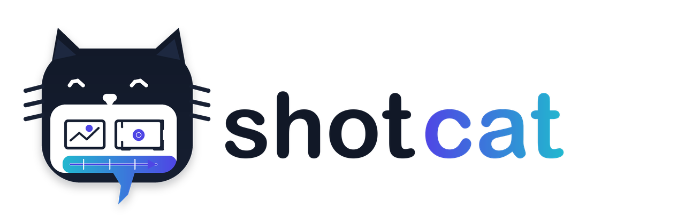
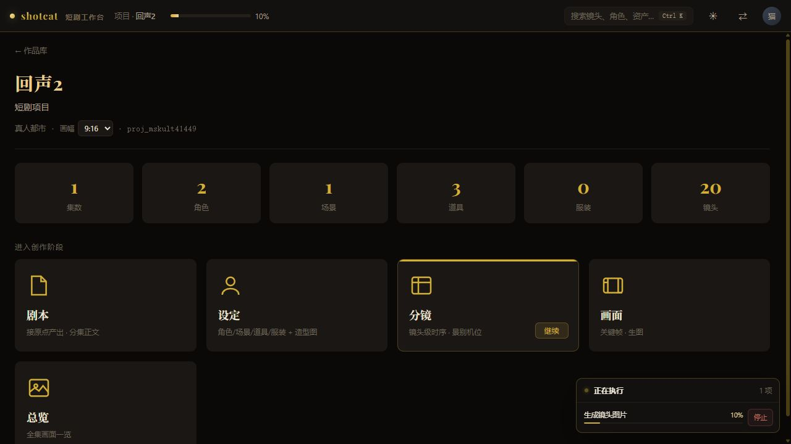
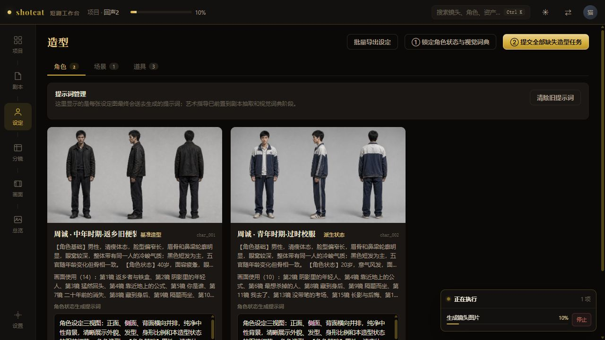
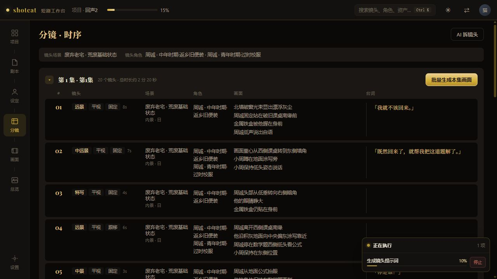
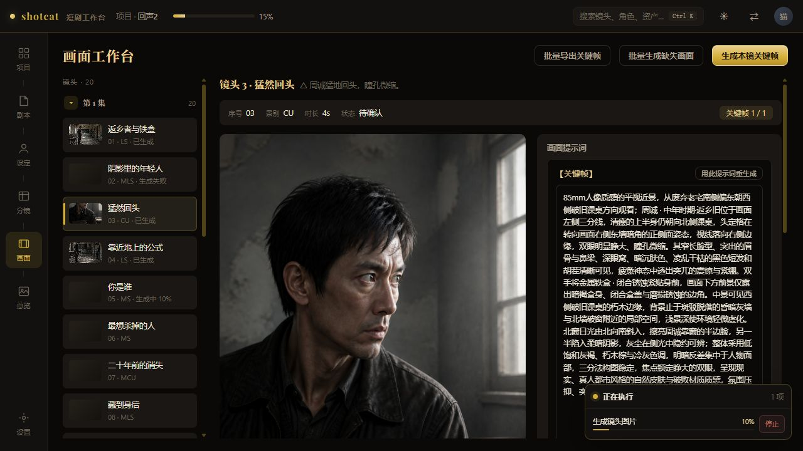

<p align="center">
  
</p>

<p align="center">
  
  <a href="LICENSE"></a>
  <a href="https://github.com/mmlong818/shotcat/commits/master"></a>
  <a href="https://github.com/mmlong818/shotcat/stargazers"></a>
  
  
</p>

<p align="center">
  <a href="README.md">简体中文</a> · English
</p>

# shotcat

A local-first workspace for short dramas, motion comics, and narrative image production. `plotcat` handles screenwriting; `shotcat` turns scripts into reviewable and traceable characters, scenes, props, storyboards, and keyframes that can be generated in batches.

Current version: **2.0.0 (independent development build)**

## Product UI

All screenshots come from real projects and generated results in the current `web/` workspace.

### Project overview



### Characters and derived states



### Shot-level storyboard



### Keyframe workspace



## Current workflow

```text
Project and script
  -> Full-script analysis, category extraction, and asset deduplication
  -> Base and derived states for characters, scenes, and props
  -> AI shot breakdown, director review, and targeted correction
  -> Shot prompts and reference-image constraints
  -> Single or batch keyframe generation
  -> Episode overview and packaged export
```

### Script and visual setup

- Extract characters, scenes, props, and chapter information from the full script; classify and deduplicate before creating derived states.
- Manage age, identity, hair, makeup, and costume changes through a base-design plus derived-state model.
- Split scenes and key props only when the visual difference is meaningful; time of day, weather, and minor changes stay in shot prompts.
- Design images support reference constraints, batch generation, cancellation, refresh recovery, custom uploads, user-defined names, and batch export.

### Storyboard design

- Storyboards use a two-pass draft and director-review workflow, with complete source-text coverage before shots are persisted.
- Each scene records stable spatial structure, viewing direction, visible range, character position, pose, orientation, and eye line.
- Later shots inherit prior state unless movement or pose changes are explicit, reducing unexplained spatial drift.
- Adjacent shots track action matches, eye-line matches, visual focus, causality, and reactions instead of illustrating every sentence mechanically.
- When director review finds a critical issue, the complete draft is retained and only confirmed shots are corrected; switching pages does not cancel the task.
- Black frames are valid shots. Speakers, listeners, and dialogue text are stored separately.

### Image generation

- Each shot has one editable keyframe prompt describing only visible, static content.
- Character identity is separated from per-shot pose, and stable scene structure is separated from the current camera position.
- Keyframes automatically reference the character, scene, prop, and user-uploaded design images linked to the shot.
- Characters facing away or hidden by occlusion are not asked to show invisible expressions; wide shots do not rely on eye or tear details to communicate the story.
- Supports single-shot and episode-wide batch generation, live task summaries, cancellation, refresh recovery, and packaged keyframe export.
- Completed batch items refresh their thumbnails and active canvas immediately without waiting for the full batch.

The daily workflow currently ends at keyframe delivery. Video-generation support remains available in the backend but is not required for the image workflow.

## Primary workspace and local data

Use the `web/` workspace for daily production: <http://127.0.0.1:5273>. It is the current product UI and the only interface used as the baseline for feature verification.

`app/front/` is the legacy Studio administration UI on port `7788`. It remains for maintenance and compatibility but is not the current workspace.

Project data, generated images, and secrets stay on the local machine by default:

- Database: `app/backend/jellyfish.db`
- Generated files: `app/backend/local-storage/`
- Environment configuration: `app/backend/.env`

Git synchronizes code and documentation only. Back up the database and generated files separately when moving to another machine.

## Repository structure

| Directory | Purpose |
| --- | --- |
| `web/` | Current daily workspace, served on port `5273`. |
| `app/backend/` | FastAPI API, SQLite data, task queue, assets, storyboards, and image generation. |
| `bridge/` | Script analysis, setup extraction, visual dictionary, AI shot breakdown, and Pipeline service. |
| `app/front/` | Legacy Studio administration UI for maintenance and compatibility. |
| `docs/assets/readme/` | Versioned screenshots used by the README files. |

## Local setup

### Requirements

- Python 3.11+
- Node.js 18+ and pnpm
- An image-model API. Text Pipeline tasks can use an external API or reuse a locally authenticated Codex CLI.
- Optional Redis and Celery worker. Without them, tasks fall back to local backend execution.

### 1. Start the backend

```bash
cd app/backend
cp .env.example .env
uv sync --group dev
uv run uvicorn app.main:app --host 127.0.0.1 --port 8000
```

- API: <http://127.0.0.1:8000>
- API documentation: <http://127.0.0.1:8000/docs>

For a dedicated worker, open another terminal:

```bash
cd app/backend
uv run celery -A app.core.celery_app.celery_app worker --loglevel=INFO
```

### 2. Start the Pipeline service

Setup extraction, the visual dictionary, and AI shot breakdown depend on this service:

```bash
cd bridge
python pipeline_server.py
```

Service URL: <http://127.0.0.1:5280>

To run setup extraction, Project Brain analysis, and shot breakdown through the locally authenticated Codex provider, set this before starting Pipeline:

```powershell
$env:SHOTCAT_TEXT_PROVIDER="codex"
python pipeline_server.py
```

Optionally set `SHOTCAT_CODEX_MODEL` to pin a Codex model. When omitted, Shotcat uses the current Codex default. This covers text tasks only; image generation still requires a separately configured image provider.

### 3. Start the workspace

```bash
cd web
pnpm install
pnpm dev
```

Open <http://127.0.0.1:5273>.

On first launch, if the database has no usable models, the workspace asks for separate text-model and image-model connections. Providers, model IDs, API URLs, and keys can be configured independently. Never commit real keys. When Pipeline uses Codex, Shotcat neither reads nor stores Codex credentials; it only invokes the locally authenticated Codex CLI.

## Usage

1. Fill in the creative brief, create a project, and enter chapter text on the Script page. The brief becomes locked project rules.
2. Run setup extraction and review the full-script character, scene, and prop categories.
3. Confirm base assets and derived states on the Setup page, refine descriptions, and generate or upload reference designs.
4. Run AI shot breakdown on the Storyboard page, review director feedback, and confirm required corrections.
5. Select batch generation to enter the Keyframe workspace and monitor prompt and image-generation progress for each shot.
6. Review keyframes, reference relationships, and prompts; regenerate individual shots or cancel tasks when needed.
7. Export keyframes in batches from the Keyframe or Overview page.

## Development and verification

Type-check and build the current workspace:

```bash
cd web
pnpm exec tsc -b
pnpm build
```

Run backend tests:

```bash
cd app/backend
uv run pytest -q
```

Run Bridge rule tests:

```bash
pytest bridge -q
```

If the legacy Studio frontend is still maintained after a backend API change, regenerate its OpenAPI client:

```bash
cd app/front
pnpm run openapi:update
```

## License

[PolyForm Noncommercial 1.0.0](LICENSE). Personal use, study, modification, and noncommercial distribution are permitted. Commercial use is not permitted.

Copyright © 2026 Maoshu
