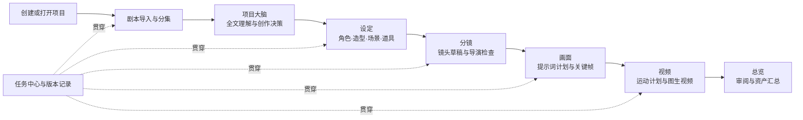
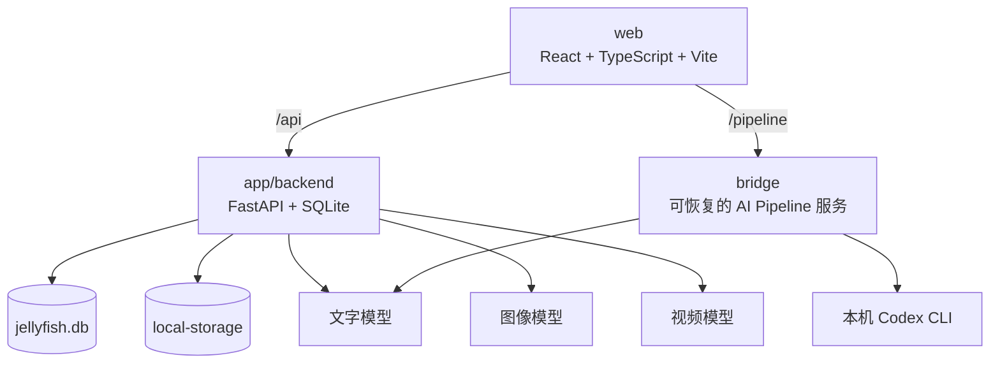

<p align="center">
  
</p>

<p align="center">
  <a href="README.md">简体中文</a> · <a href="README.en.md">English</a>
</p>

<p align="center">
  
  
  
  
  
  
  <a href="LICENSE"></a>
  <a href="https://github.com/mmlong818/shotcat"></a>
</p>

# Shotcat 2.0

Shotcat 2.0 是一个本地优先的 AI 漫剧、短剧与影视预演工作台。它把项目理解、设定管理、分镜设计、画面提示词、关键帧生成和图生视频串成一条可恢复、可审阅、可修正的生产流程。

它不是一次性“生成整部作品”的黑盒。每个阶段都有明确输入、可检查的中间结果、版本记录和任务状态；角色、场景、道具、造型等资产会以稳定引用进入后续分镜、画面和视频任务。

> Shotcat 2.0 与 [Shotcat 1.x](https://github.com/mmlong818/shotcat) 分开开发。1.x 的 Star 历史保留在原仓库；2.0 不会覆盖原项目代码或本地数据。

## 2.0 的核心变化

- **项目大脑**：把原文事实、用户决定和 AI 推断分开保存，支持确认、否决、锁定和重新分析。
- **一致性资产链**：角色、造型、场景、道具可生成、上传、重命名、采用和锁定，并在后续任务中按 ID 引用。
- **导演式分镜**：先落地完整草稿，再执行导演检查；确认问题后只修正对应镜头，黑屏、空镜和转场镜头均可合法存在。
- **Prompt-as-Code**：画面提示词拆成主体、动作、构图、镜头、光线、连续性、参考图角色和负向约束，方便审阅与复用。
- **视频工作台**：独立配置视频模型，支持首帧、尾帧、首尾帧、关键帧和纯文本等模式，并先展示可编辑的执行计划。
- **持久任务中心**：页面切换或刷新后仍可恢复进度；任务支持取消、失败重试和结果回填。
- **可回退版本**：项目概览集中展示阶段完成度、版本快照和恢复入口。
- **双主题界面**：所有主要工作页支持浅色和深色显示。

## 完整工作流



新建项目会直接进入“剧本”，让用户从素材开始；再次打开已有项目时会进入“项目概览”，同时标出上次尚未完成的阶段。

## 界面预览

以下为 2.0 工作台的代表性截图。界面会随开发持续调整，实际功能以当前代码为准。

| 项目概览 | 设定资产 |
| --- | --- |
|  |  |

| 分镜设计 | 画面生成 |
| --- | --- |
|  |  |

## 能力总览

| 阶段 | 主要输入 | 主要产出 | 可控内容 |
| --- | --- | --- | --- |
| 项目 | 名称、类型、比例、素材 | 项目容器、进度、版本 | 创建、打开、归档、恢复 |
| 剧本 | 文本或文件 | 分集、场次、对白与动作 | 编辑、重新解析、来源保留 |
| 大脑 | 全文剧本、创作要求 | 世界观、人物关系、主题、事实与推断 | 确认、否决、锁定、重分析 |
| 设定 | 剧本实体、用户参考图 | 角色、造型、场景、道具资产 | 上传、命名、生成、采用、锁定、删除影响检查 |
| 分镜 | 场次、资产、导演规则 | 有连续关系的镜头列表 | 拆镜、镜头语言、导演校验、定点修正 |
| 画面 | 镜头和资产引用 | 结构化提示词、关键帧图片 | 构图、连续性、参考图角色、单张或批量生成 |
| 视频 | 关键帧、镜头动作、视频模型 | 运动计划、视频片段、任务状态 | 首尾帧策略、时长、分辨率、提示词、取消 |
| 总览 | 全部已落地资产 | 项目级审阅视图 | 汇总检查与回到来源阶段 |

## 关键设计

### 项目大脑：先区分事实，再做创作

项目大脑不会把所有 AI 输出都当成事实。每条知识都有来源和状态：

- **来源**：原文、用户输入或 AI 推断。
- **状态**：草稿、已确认或已否决。
- **锁定**：锁定内容不会被后续重新分析自动覆盖。

这让重新抽取设定、修改剧本或重跑某一步时，不会悄悄抹掉已经确认的创作决定。

### 设定资产：稳定引用而不是只看缩略图

角色、造型、场景和道具都作为独立资产保存。用户可以直接上传认可的设计稿、自行命名并设为正式版本。分镜和画面任务引用资产记录，而不是依赖临时文件名，因此重命名、切换版本或重新生成后仍能保持关联。

删除资产前会检查使用关系，并说明会影响哪些下游内容。确认级联删除后，相关引用和派生结果会一并处理，避免留下失效的镜头或提示词。

### 分镜：先保存，再校验，再定点修正

一次完整拆镜遵循以下顺序：

1. 先生成并保存完整镜头草稿。
2. 导演规则检查景别、机位、运动、轴线、节奏、对白归属和镜头连续性。
3. 如果发现问题，显示具体镜头与原因。
4. 用户确认后自动开始修正，只覆盖被点名的镜头。
5. 保留未受影响镜头以及可恢复的任务、版本记录。

规则允许黑屏、空镜、字幕、声音先行等叙事镜头，不会为了“每个镜头都必须有人物画面”而错误填充内容。

### 画面：结构化提示词与连续性计划

每个镜头的画面任务会先产生可审阅计划，再调用图像模型。计划包含：

- 主体身份与当前造型；
- 场景、时间、天气和光线；
- 动作、表情、视线和空间位置；
- 景别、角度、镜头焦段、构图和景深；
- 与前后镜头衔接的连续性约束；
- 角色图、造型图、场景图、道具图的参考角色；
- 模型不应生成的负向约束。

OpenAI `gpt-image-2` 路径会把真实参考图字节作为重复的 `image[]` multipart 字段发送，不把 Shotcat 内部文件 ID 当作图像内容。

### 视频：图像之后的独立生产阶段

视频页以镜头为单位组织任务。用户可以选择可用模型、参考帧方式、分辨率和时长，检查系统生成的运动计划，再编辑最终提示词并执行。

计划会明确展示：

- 起始与结束画面状态；
- 人物动作、摄影机运动与节奏；
- 首帧、尾帧和关键帧分别承担什么作用；
- 时间线分段和音频处理建议；
- 模型能力不匹配时的警告。

当前 MiniMax H3 适配支持纯文本、首帧、尾帧、首尾帧和关键帧模式，支持 768P / 2K、4–15 秒；不支持同时使用“首帧 + 尾帧 + 关键帧”，也不把 seed 或 watermark 作为可用控制项。

> “已适配”表示代码中已有供应商调用和能力约束，不代表你的账号已开通对应模型，也不代表付费调用已经在本机完成验证。

## 模型与供应商

Shotcat 把文字、图像和视频模型分开配置，不要求三类任务使用同一家供应商。

| 能力 | 内置供应商适配 | 说明 |
| --- | --- | --- |
| 文字 | OpenAI、阿里云百炼、本机 Codex 管线 | 用于剧本理解、设定、分镜、提示词和计划 |
| 图像 | OpenAI、火山引擎 | 用于设定稿和镜头关键帧 |
| 视频 | OpenAI、火山引擎、MiniMax | 用于按镜头生成视频片段 |

首次启动若没有可用文字或图像模型，应用会引导输入供应商、模型 ID、接口地址和 Key。视频模型在“视频”页独立配置。配置保存在本机数据库中，不应提交到 Git。

供应商模型名称、权限和计费会变化。界面中的模型 ID 应以你的供应商控制台为准；仓库提供的是接入能力，不附带 Key、额度或模型授权。

## 本地优先与数据位置

默认情况下，项目数据和生成结果保存在本机：

| 数据 | 默认位置 |
| --- | --- |
| 业务数据库 | `app/backend/jellyfish.db` |
| 图片、视频和上传文件 | `app/backend/local-storage/` |
| 后端私密配置 | `app/backend/.env` |
| Pipeline 任务快照 | `bridge/pipeline-jobs.json` |
| 页面偏好与少量任务引用 | 浏览器本地存储 |

后端任务记录是生成状态的主要来源，刷新页面或切换阶段后会重新读取，因此运行中、完成、失败和已取消状态不会只存在于当前页面内存。

可选的 S3、Redis 和 Celery 配置用于外部存储或队列；未配置时使用本地文件和本地执行路径。调用外部 AI 模型时，相关提示词和参考素材会发送给你选择的供应商，请按供应商的数据政策使用。

## 系统结构



```text
shotcat-2.0/
├─ web/                    # 当前 React 工作台
├─ app/
│  ├─ backend/            # FastAPI、数据库、任务与模型适配
│  └─ front/              # 旧版前端，仅用于兼容和参考
├─ bridge/                 # 分镜等长任务的可恢复 Pipeline 服务
├─ docs/assets/readme/     # README 截图
├─ assets/                 # Logo 等仓库资源
├─ README.md               # 中文说明
└─ README.en.md            # English documentation
```

## 本机启动

以下命令以 Windows PowerShell 为例。建议使用三个终端分别运行后端、Pipeline 和前端。

### 1. 启动后端

需要 Python 3.11+；推荐 Python 3.12 和 [uv](https://docs.astral.sh/uv/)。

```powershell
cd E:\codex\shotcat-2.0\app\backend
if (-not (Test-Path .env)) { Copy-Item .env.example .env }
uv sync --python 3.12 --group dev
uv run uvicorn app.main:app --host 127.0.0.1 --port 8000
```

数据库会在启动时自动初始化。验证地址：

- 健康检查：<http://127.0.0.1:8000/health>
- API 文档：<http://127.0.0.1:8000/docs>

### 2. 启动 Pipeline

Pipeline 负责可恢复的长流程任务。使用本机已登录的 Codex 作为文字提供方时：

```powershell
cd E:\codex\shotcat-2.0\bridge
$env:SHOTCAT_TEXT_PROVIDER = "codex"
# 可选：$env:SHOTCAT_CODEX_MODEL = "你的可用模型"
python pipeline_server.py
```

默认监听 `http://127.0.0.1:5280`。若不设置 `SHOTCAT_TEXT_PROVIDER`，请按本机已有供应商配置运行。

### 3. 启动前端

```powershell
cd E:\codex\shotcat-2.0\web
corepack pnpm install
corepack pnpm dev
```

打开 <http://127.0.0.1:5273>。

### 使用其他端口

```powershell
# 后端终端
uv run uvicorn app.main:app --host 127.0.0.1 --port 8010

# Pipeline 终端
$env:SHOTCAT_PIPELINE_PORT = "8020"
python pipeline_server.py

# 前端终端
$env:SHOTCAT_API_TARGET = "http://127.0.0.1:8010"
$env:SHOTCAT_PIPELINE_TARGET = "http://127.0.0.1:8020"
corepack pnpm exec vite --host 127.0.0.1 --port 8030
```

## 第一次使用

1. 创建项目，设置名称、画面比例和基础信息。
2. 在“剧本”导入或粘贴文本，并确认分集、场次和对白解析。
3. 若出现模型配置引导，分别填写文字和图像模型；视频模型可稍后在视频页配置。
4. 在“项目大脑”确认核心事实、人物关系和创作决定。
5. 在“设定”检查角色、造型、场景和道具，上传或生成正式参考图并锁定。
6. 在“分镜”先执行 AI 拆镜，完成导演检查和必要修正。
7. 在“画面”检查每个镜头的提示词计划，再生成关键帧。
8. 在“视频”检查运动计划和参考帧，再生成镜头视频。
9. 在任务中心查看总体进度；需要时取消任务、重试失败项或恢复旧版本。

## 开发验证

```powershell
# 后端测试
cd E:\codex\shotcat-2.0\app\backend
uv run pytest -q

# Pipeline 测试（复用后端开发环境）
cd E:\codex\shotcat-2.0
.\app\backend\.venv\Scripts\python.exe -m pytest bridge -q

# 前端生产构建
cd E:\codex\shotcat-2.0\web
corepack pnpm build
```

测试和构建通过只能证明本地代码路径可运行；真实生图、视频质量、调用速度和费用仍取决于所选模型、账号权限、网络和供应商状态。

## 当前边界

- 仓库不包含任何模型 Key、付费额度或第三方账号权限。
- 视频阶段当前以“按镜头生成片段”为核心，不等同于完整的非线性剪辑、配音、混音和成片封装系统。
- `app/front` 是旧版界面；日常开发和使用以 `web` 为准。
- 项目仍处于积极开发期，数据库结构或局部交互可能在升级前发生变化；重要项目请备份数据库和 `local-storage`。

## 安全与隐私

- 不要把 `.env`、数据库、Key、Cookie 或本地生成素材提交到公开仓库。
- 公开问题报告前请检查截图、日志、提示词和素材是否包含私人内容。
- 只在可信网络中暴露服务；默认的 `127.0.0.1` 监听不会主动开放到局域网。

## 许可证

Shotcat 2.0 使用 [PolyForm Noncommercial License 1.0.0](LICENSE)。个人学习、研究和非商业用途可按许可证使用；商业使用需另行获得授权。

Copyright © 2026 猫叔。
